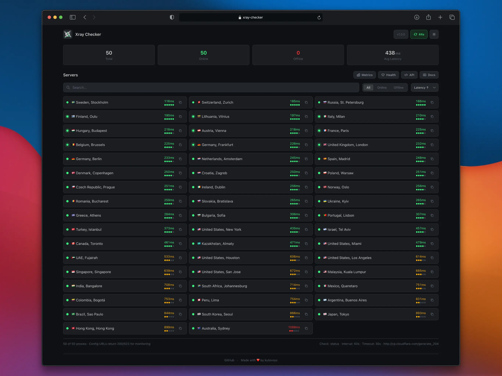

:::tip[دمو را امتحان کنید]
Xray Checker را در عمل ببینید: [demo-xray-checker.kutovoy.dev](https://demo-xray-checker.kutovoy.dev/)
:::

Xray Checker یک راهکار جامع نظارتی است که برای تأیید و پیگیری در دسترس بودن سرورهای پروکسی با [پروتکل‌های](/fa/configuration/subscription) مختلف از جمله VLESS، VMess، Trojan و Shadowsocks طراحی شده است. این ابزار با در نظر گرفتن شیوه‌های مدرن DevOps ساخته شده و به طور یکپارچه با [سیستم‌های نظارتی محبوب](/fa/integrations/metrics) ادغام می‌شود و آمار لحظه‌ای برای زیرساخت پروکسی شما فراهم می‌کند.

## Xray Checker چیست؟

Xray Checker به عنوان پلی بین سرورهای پروکسی و زیرساخت نظارتی شما عمل می‌کند:

- تست مداوم اتصالات پروکسی از طریق Xray Core
- ارائه متریک‌های Prometheus برای نظارت دقیق
- فراهم کردن endpoint وضعیت برای نظارت بر آپتایم
- پشتیبانی از به‌روزرسانی خودکار پیکربندی از URL‌های اشتراک
- ارائه رابط کاربری مبتنی بر وب ساده و کارآمد برای بررسی سریع وضعیت

Xray Checker را به عنوان مانیتور سلامت زیرساخت پروکسی خود در نظر بگیرید - به طور مداوم نبض سرویس‌های شما را چک می‌کند، علائم حیاتی را گزارش می‌دهد و هنگامی که چیزی نیاز به توجه دارد به شما هشدار می‌دهد.
